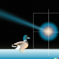

# mcmphoton
## A Monte Carlo simulation of photons in a medium



This is a simple Monte Carlo simulation of photons in a medium. The photons are emitted from a point source and travel in a medium with a given refractive index. The photons are scattered by the medium and the simulation stops when the photons are absorbed by the medium.

## How to run this project (under linux)
1. **Clone** the repository and **cd** into it. 
2. Create a virtual environment:
	```bash
	python -m venv venv
	```
3. Activate the virtual environement: 
	```bash
	. venv/bin/activate
	```
4. Install the module:
	```bash
	pip install .
	```
5. Run the example:
	```bash
	python examples/example_1.py
	```
6. After a few seconds (depending on your system) you should see the simulation result :-).

## Requirements
- python 3.8 or later
- numpy
- matplotlib
- sympy


